# Backend per la gestione di modelli di ottimizzazione su grafi
--- 
Realizzazione di un backend per la gestione della creazione e della valutazione di modelli di ottimizzazione su grafo. Questo progetto riguarda l'esame pratico di Programamzione Avanzata (A.A. 2025/2026) del corso di Laurea Magistrale in Ingegneria Informatica e dell'Automazione tenuto presso UNIVPM.

### Indice

<!-- TOC start (generated with https://github.com/derlin/bitdowntoc) -->

- [Obiettivo del progetto](#obiettivo-del-progetto)
- [Progettazione](#progettazione)
   * [Diagramma dei casi d'uso](#diagramma-dei-casi-duso)
   * [Elenco delle rotte](#elenco-delle-rotte)
   * [Diagrammi di sequenza](#diagrammi-di-sequenza)
   * [Design Pattern utilizzati](#design-pattern-utilizzati)
- [Installazione e avvio](#installazione-e-avvio)
- [Testing ](#testing)

<!-- TOC end -->

<!-- TOC --><a name="obiettivo-del-progetto"></a>
## Obiettivo del progetto

Realizzazione di un sistema che consenta di gestire la creazione e valutazione di modelli di ottimizzazione su grafo. Il sistema permette di gestire l'aggiornamento di pesi effettuato da utenti autenticati mediante JWT, simulando il concetto di crowd-sourcing .

#### Tecnologie utilizzate

- **Node.JS** - Runtime JavaScript
- **Express** - Framework web
- **Sequelize** - ORM per database relazionali
- **RDBMS** - PostgreSQL
- **node-dijkstra** - Libreria per algoritmo di Dijkstra ([github.com/albertorestifo/node-dijkstra](https://github.com/albertorestifo/node-dijkstra))
- **TypeScript** - Linguaggio utilizzato per lo sviluppo

### Requisiti Funzionali

#### 1. Gestione dei Modelli di Ottimizzazione

- **Creazione**: Creare nuovi modelli seguendo l'interfaccia definita in node-dijkstra, specificando il grafo con i relativi pesi
- **Validazione**: Validare le richieste di creazione del modello
- **Sistema di Token**:
  - Addebitare token per la creazione: 0.20 per ogni nodo e 0.05 per ogni arco
  - Il modello può essere creato solo se c'è credito sufficiente
  - Ogni utente ha un numero iniziale di token nel database

#### 2. Esecuzione dei Modelli

- Eseguire il modello fornendo un nodo di partenza (start) e uno di arrivo (goal)
- Applicare un costo per l'esecuzione pari a quello addebitato nella fase di creazione
- Ritornare il risultato in formato JSON con:
  - Il percorso ottimale
  - Il costo del percorso (in termini di pesi del grafo)
  - Il tempo di esecuzione dell'algoritmo

#### 3. Aggiornamento dei Pesi degli Archi

- Consentire agli utenti autenticati di richiedere aggiornamenti di peso per uno o più archi
- **Formula di aggiornamento**: Media esponenziale $p_{i,j} = \alpha \cdot p_{i,j} + (1 - \alpha) \cdot p_{new}$
  - $p_{i,j}$ = precedente costo dell'arco
  - $p_{new}$ = nuovo costo suggerito
  - $\alpha$ = parametro configurabile via variabile d'ambiente (default: 0.8, intervallo: 0 < α < 1)
- **Validazione delle richieste**: Una richiesta è valida se il peso non si discosta per più del **50%** dal valore attuale
- **Richieste anomale**: Gli aggiornamenti che superano il 50% devono essere approvati/rifiutati da un utente admin

#### 4. Gestione degli Accessi e dei Ruoli

- Tutte le chiamate devono essere autenticate con **JWT** (schema RS256)
- **Utente standard**: Può creare modelli, eseguirli e suggerire aggiornamenti di peso
- **Utente admin**: 
  - Visualizzare le richieste di aggiornamento in attesa di conferma
  - Approvare o rifiutare aggiornamenti anomali
  - Ricaricare i token per altri utenti (fornendo email e nuovo credito)
  - Visualizzare il log degli aggiornamenti

#### 5. Gestione Token

- Ogni utente ha un numero di token residuo memorizzato nel database
- Quando i token terminano, ogni richiesta dell'utente deve ritornare **401 Unauthorized**
- Rotta admin per ricaricare i token di un utente

#### 6. Log e Storico degli Aggiornamenti

- Restituire l'elenco degli aggiornamenti dei pesi di un dato modello in formato **JSON** o **CSV** (tramite querystring)
- Supportare filtri per:
  - Data di modifica (inizio, fine o entrambe)
  - Status della richiesta
- Validare le richieste di filtro

### Specifiche Tecniche

- **Database**: Script di seed per inizializzare il sistema
  - Almeno 2 modelli diversi per la demo
  - Almeno due versioni per modello
  - Minimo 8 nodi e 16 archi per modello
- **Middleware**: Utilizzo delle funzionalità di middleware di Express
- **Gestione errori**: Utilizzo di middleware per gestire e sollevare eccezioni
- **Autenticazione**: JWT con chiave privata RS256 memorizzata in file `.env`
- **Documentazione**: Design Pattern utilizzati devono essere documentati nel README

<!-- TOC --><a name="progettazione"></a>
## Progettazione

<!-- TOC --><a name="diagramma-dei-casi-duso"></a>
### Diagramma dei casi d'uso

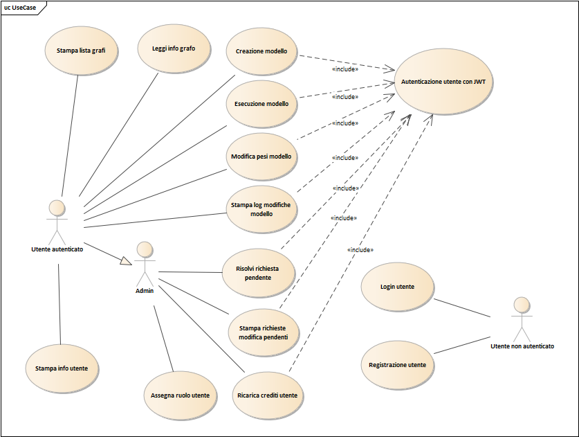

<!-- TOC --><a name="elenco-delle-rotte"></a>
### Elenco delle rotte
| Rotta | Metodo HTTP | Ruolo | Parametri | Descrizione |
| :--- | :--- | :---: | :--- | :--- |
| `/` | GET | - | - | Pagina di benvenuto |
| `/login` | POST | - | {email, password} | Effettua il login e restituisce il token JWT associato all'utente |
| `/register` | POST | - | {username, email, password} | Crea un nuovo utente e fa il login restituendo il JWT |
| `/users/:id` | GET | User Owner o Admin | - | Restituisce i dati di un utente |
| `/admin/rechargeToken` | PATCH | Admin | {email, qtyToken} | Ricarica i token ad un utente |
| `/admin/pending` | PATCH | Admin | {updateId, status} | Risolve una richiesta di modifica pendente |
| `/admin/pending` | GET | Admin | - | Restituisce la lista delle richieste di modifica pendenti |
| `/admin/changeRole` | PATCH | Admin | {email, isAdmin} | Assegna un ruolo ad un utente |
| `/graphs` | GET | User | - | Restituisce la lista di tutti i grafi |
| `/graphs` | POST | User | {name, description, nodes[], edges[\{startNode, endNode, weight\}]}  | Crea un nuovo grafo e i rispettivi archi |
| `/graphs/:id` | GET | User | id tra i Params | Restituisce le informazioni del grafo |
| `/graphs/:id/run` | POST | User | id tra i Params, {startNode, endNode} | Calcola il percorso tra due nodi su un grafo |
| `/graphs/:id` | PATCH | User | id tra i Params, [\{edgeId, newWeight\}] | Richiede la modifica dei pesi di alcuni archi di un grafo |
| `/graphs/:id/log?startDate=&endDate=` | GET | User | id, startDate e endDate tra i params, {format}| Restituisce la lista delle modifiche di un grafo |

**NB.** Tutte le rotte in cui l'utente deve essere autorizzato (cioè deve avere un ruolo) è sottointeso che ci sia il token JWT nell'authorization


<!-- TOC --><a name="diagrammi-di-sequenza"></a>
### Diagrammi di sequenza

#### POST /auth/login
Effettua il login di un utente fornendo le credenziali (email e password). Il middleware valida il formato dei dati, il controller verifica le credenziali nel database e genera il token JWT di autenticazione.

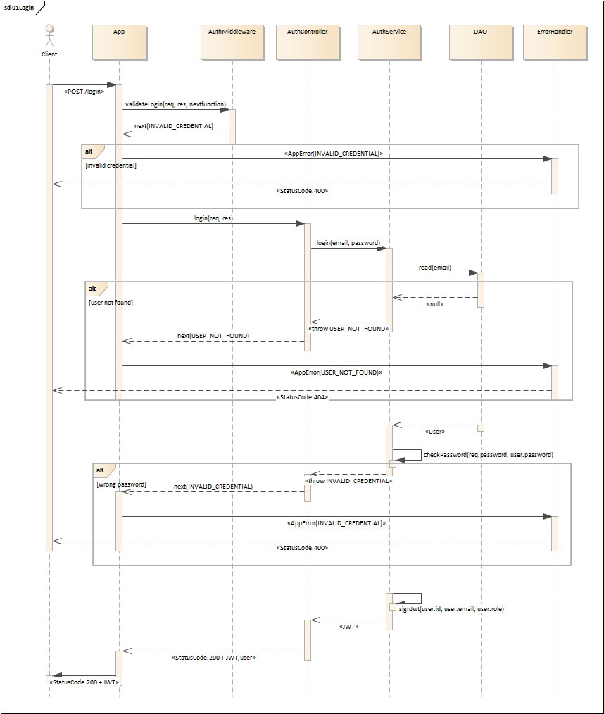

**Errori possibili:** `INVALID_EMAIL`, `INVALID_PASSWORD`, `USER_NOT_FOUND`, `INTERNAL_SERVER_ERROR`
**Successo:** `USER_LOGGED_IN` (HTTP 200) - Ritorna il JWT token e i dati dell'utente

---

#### POST /auth/register
Crea un nuovo utente nel sistema. Il middleware valida username, email e password, il controller crea l'utente nel database e restituisce automaticamente il token JWT di autenticazione.

**Errori possibili:** `INVALID_USERNAME`, `INVALID_EMAIL`, `INVALID_PASSWORD`, `USER_ALREADY_EXISTS`, `INTERNAL_SERVER_ERROR`
**Successo:** `USER_REGISTERED` (HTTP 201) - Ritorna il JWT token e i dati dell'utente creato

---

#### GET /users/:id
Restituisce i dati di un utente specifico. Solo il proprietario o un admin possono accedere a questa rotta. Il middleware verifica il JWT e che l'utente sia autorizzato.

**Errori possibili:** `JWT_NOT_PROVIDED`, `INVALID_JWT`, `TOKENS_FINISHED`, `INVALID_ID`, `NOT_OWNER_OR_ADMIN`, `USER_NOT_FOUND`, `INTERNAL_SERVER_ERROR`
**Successo:** `USER_FOUND` (HTTP 200) - Ritorna i dati dell'utente (username, email, qtyToken, isAdmin)

---

#### PATCH /admin/rechargeToken
Ricarica i token ad un utente specifico. Solo un admin può eseguire questa operazione. Richiede l'email dell'utente e la quantità di token da aggiungere.

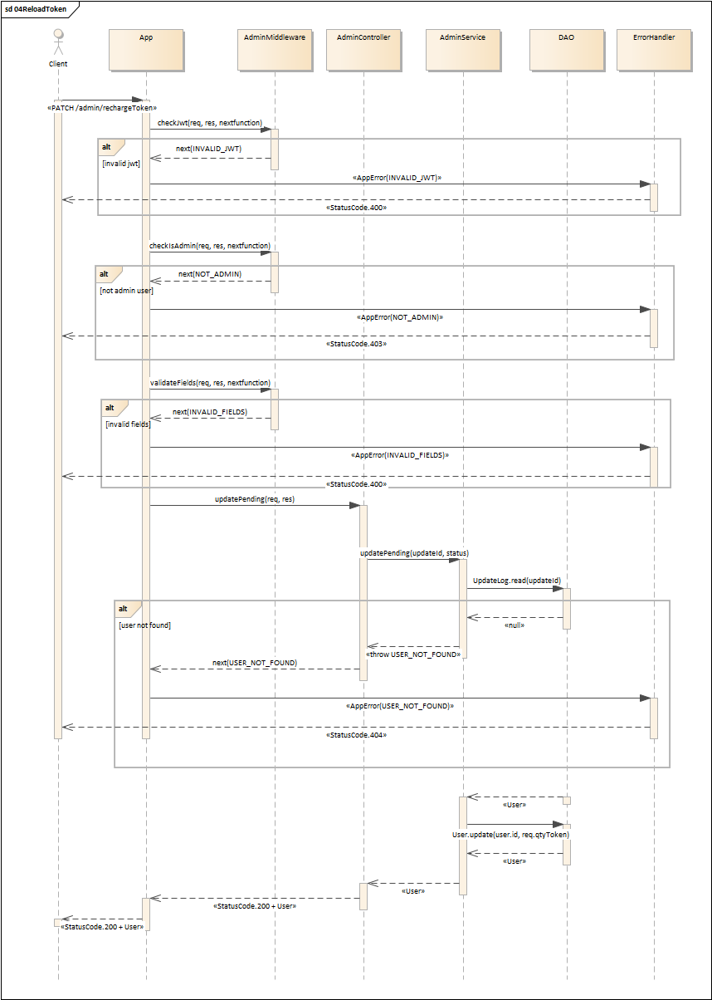

**Errori possibili:** `JWT_NOT_PROVIDED`, `INVALID_JWT`, `NOT_ADMIN`, `INVALID_EMAIL`, `INVALID_TOKEN_AMOUNT`, `USER_NOT_FOUND`, `TOKENS_FINISHED`, `INTERNAL_SERVER_ERROR`
**Successo:** `TOKENS_RECHARGED` (HTTP 200) - Ritorna i dati aggiornati dell'utente con i token ricaricati

---

#### PATCH /admin/pending
Risolve una richiesta di modifica pendente approvando o rifiutando l'aggiornamento. Solo un admin può eseguire questa operazione. Aggiorna lo stato del log di modifica e, se approvato, modifica il peso dell'arco.

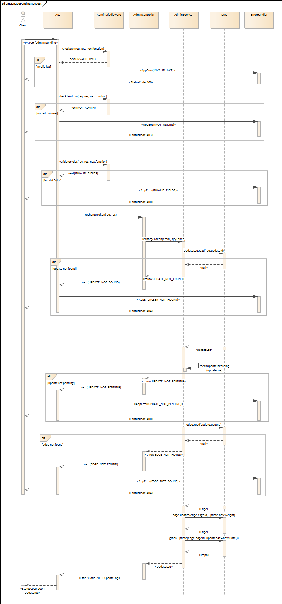

**Errori possibili:** `JWT_NOT_PROVIDED`, `INVALID_JWT`, `NOT_ADMIN`, `INVALID_ID`, `INVALID_STATUS`, `UPDATE_LOG_NOT_FOUND`, `EDGE_NOT_FOUND`, `GRAPH_NOT_FOUND`, `TOKENS_FINISHED`, `INTERNAL_SERVER_ERROR`
**Successo:** `PENDING_UPDATE_RESOLVED` (HTTP 200) - Ritorna il log di modifica aggiornato

---

#### GET /admin/pending
Restituisce la lista di tutte le richieste di modifica pendenti. Solo un admin può accedere a questa rotta.

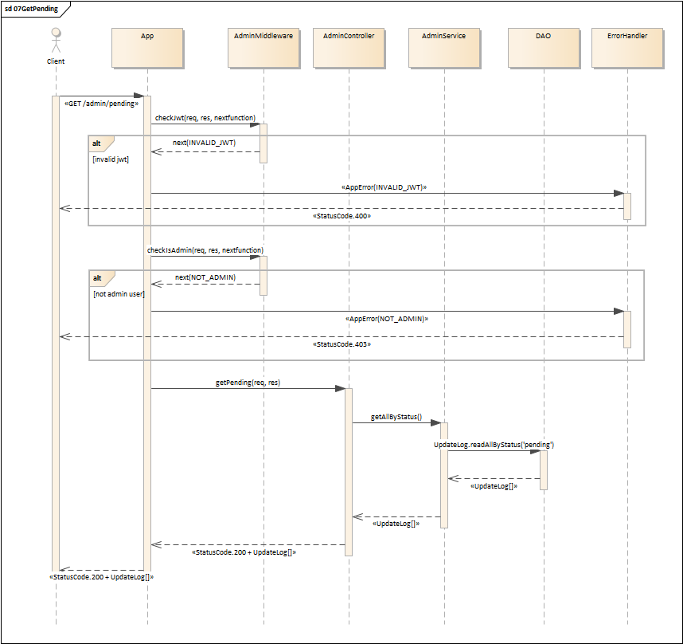

**Errori possibili:** `JWT_NOT_PROVIDED`, `INVALID_JWT`, `NOT_ADMIN`, `TOKENS_FINISHED`, `INTERNAL_SERVER_ERROR`
**Successo:** `PENDING_REQUESTS_FOUND` (HTTP 200) - Ritorna un array di UpdateLog con status='pending'

---

#### PATCH /admin/changeRole
Assegna o revoca il ruolo di amministratore a un utente. Solo un admin può eseguire questa operazione. Richiede l'email dell'utente e un valore booleano che indica se promuovere (true) o declassare (false).

**Errori possibili:** `JWT_NOT_PROVIDED`, `INVALID_JWT`, `NOT_ADMIN`, `INVALID_EMAIL`, `INVALID_ROLE`, `USER_NOT_FOUND`, `TOKENS_FINISHED`, `INTERNAL_SERVER_ERROR`
**Successo:** `ROLE_UPDATED` (HTTP 200) - Ritorna i dati aggiornati dell'utente con il nuovo ruolo

---

#### GET /graphs
Restituisce la lista di tutti i grafi disponibili nel sistema. Richiede autenticazione tramite JWT.

**Errori possibili:** `JWT_NOT_PROVIDED`, `INVALID_JWT`, `TOKENS_FINISHED`, `INTERNAL_SERVER_ERROR`
**Successo:** `GRAPHS_FOUND` (HTTP 200) - Ritorna un array di grafi con i loro nodi e archi

---

#### POST /graphs
Crea un nuovo grafo nel sistema con i relativi nodi e archi. Il middleware valida che il grafo sia connesso e che i dati siano nel formato corretto. Addebita token in base al numero di nodi e archi.

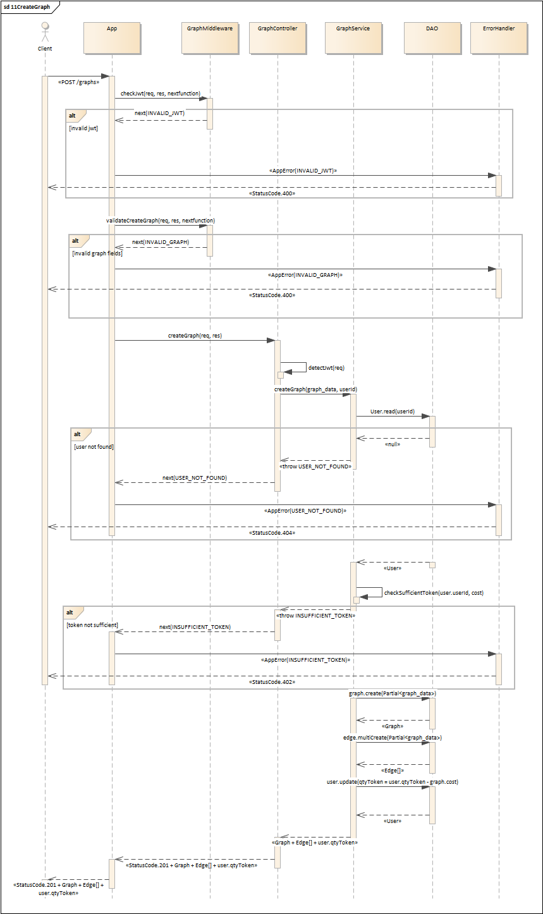

**Errori possibili:** `JWT_NOT_PROVIDED`, `INVALID_JWT`, `INVALID_GRAPH_NAME`, `INVALID_GRAPH_DESCRIPTION`, `INVALID_NODES_DATA`, `INVALID_NODES_FORMAT`, `INVALID_EDGES_DATA`, `INVALID_EDGES_FORMAT`, `EDGE_NODE_NOT_FOUND`, `GRAPH_NOT_CONNECTED`, `TOKENS_FINISHED`, `INTERNAL_SERVER_ERROR`
**Successo:** `GRAPH_CREATED` (HTTP 201) - Ritorna il grafo creato con i suoi nodi e archi

---

#### GET /graphs/:id
Restituisce le informazioni di un grafo specifico inclusi tutti i suoi nodi e archi. Richiede autenticazione tramite JWT.

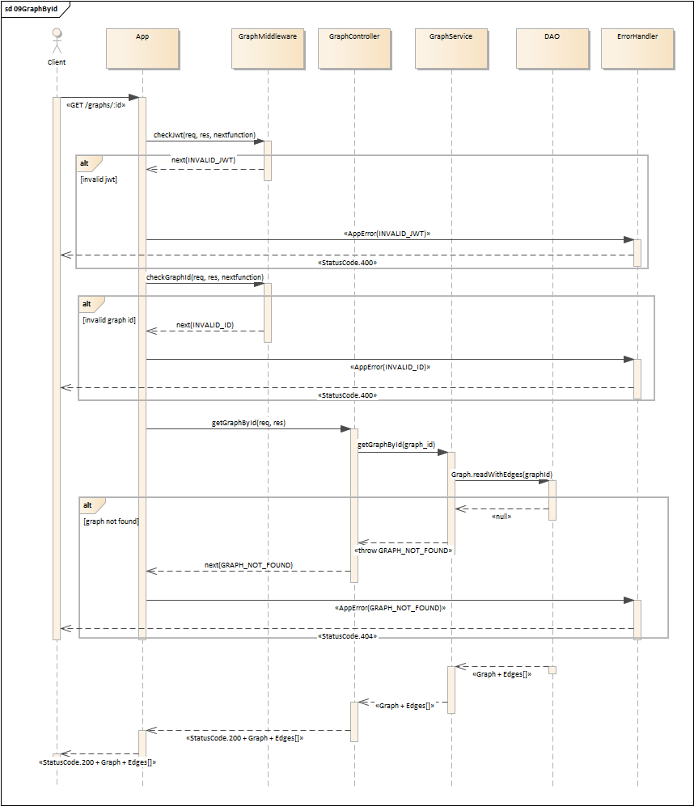

**Errori possibili:** `JWT_NOT_PROVIDED`, `INVALID_JWT`, `INVALID_ID`, `GRAPH_NOT_FOUND`, `TOKENS_FINISHED`, `INTERNAL_SERVER_ERROR`
**Successo:** `GRAPH_FOUND` (HTTP 200) - Ritorna i dettagli del grafo con nodi e archi

---

#### POST /graphs/:id/run
Esegue l'algoritmo di Dijkstra su un grafo per trovare il percorso ottimale tra due nodi. Il middleware valida i nodi di inizio e fine. Addebita token all'utente per l'esecuzione.

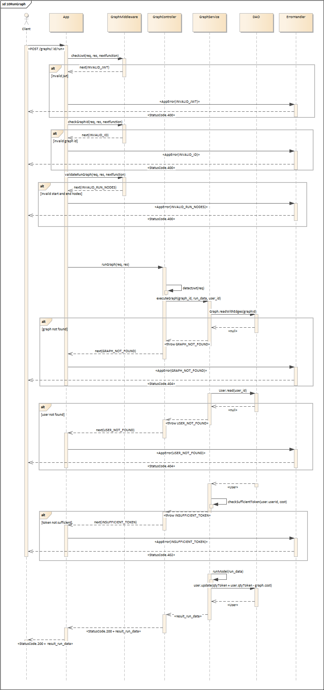

**Errori possibili:** `JWT_NOT_PROVIDED`, `INVALID_JWT`, `INVALID_ID`, `INVALID_RUN_NODES`, `GRAPH_NOT_FOUND`, `NODE_NOT_FOUND`, `TOKENS_FINISHED`, `DIJKSTRA_ERROR`, `INTERNAL_SERVER_ERROR`
**Successo:** `SHORTEST_PATH_COMPUTED` (HTTP 200) - Ritorna il percorso calcolato, il costo totale e il tempo di esecuzione

---

#### PATCH /graphs/:id
Richiede la modifica dei pesi di uno o più archi di un grafo. Se la modifica rientra nella soglia (±50%), viene applicata immediatamente, altrimenti viene creata una richiesta pendente per l'approvazione dell'admin.

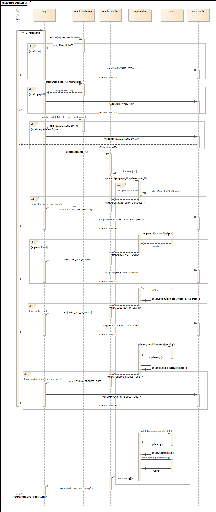

**Errori possibili:** `JWT_NOT_PROVIDED`, `INVALID_JWT`, `INVALID_ID`, `INVALID_UPDATE_DATA`, `INVALID_UPDATE_FORMAT`, `GRAPH_NOT_FOUND`, `EDGE_NOT_FOUND`, `WEIGHT_OUT_OF_RANGE`, `TOKENS_FINISHED`, `INTERNAL_SERVER_ERROR`
**Successo:** `GRAPH_EDGES_UPDATED` (HTTP 200) - Ritorna la lista di UpdateLog creati con il rispettivo status

---

#### GET /graphs/:id/log
Restituisce la lista di tutte le modifiche effettuate su un grafo. Supporta filtri per data di modifica (startDate, endDate) e formato di output (JSON o CSV).

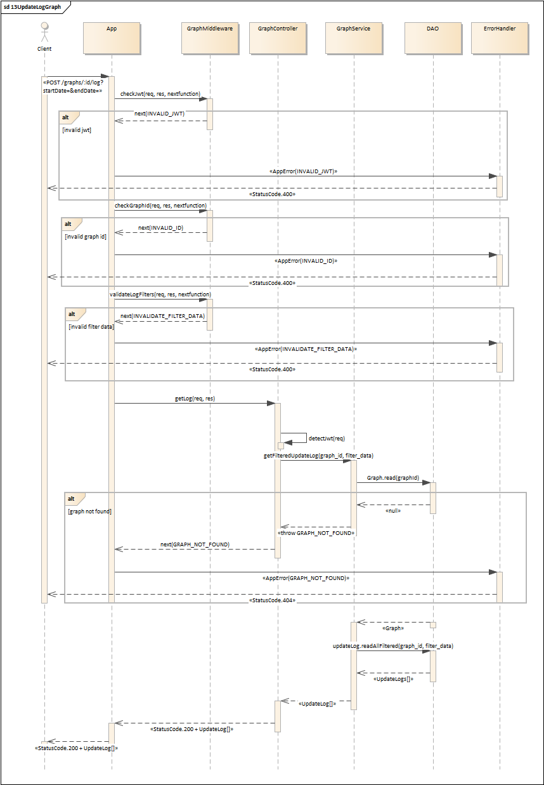

**Errori possibili:** `JWT_NOT_PROVIDED`, `INVALID_JWT`, `INVALID_ID`, `INVALID_DATE_FORMAT`, `INVALID_OUTPUT_FORMAT`, `GRAPH_NOT_FOUND`, `TOKENS_FINISHED`, `INTERNAL_SERVER_ERROR`, `CSV_GENERATION_ERROR`
**Successo:** `GRAPH_LOGS_FOUND` (HTTP 200) - Ritorna la lista di UpdateLog filtrati e in formato JSON o CSV

<!-- TOC --><a name="design-pattern-utilizzati"></a>

---
### Design Pattern utilizzati

#### M(V)C - Model View Controller (senza View)

Il pattern MVC organizza l'applicazione in tre strati logici distinti. Il *Controller* funge da intermediario tra la View (che perè, essendo un progetto backend, non è implemenato. Possiamo immaginare Postman come la view da cui riceviamo le richieste) ed il Model. Il *Model*, integrato tramite l'ORM Sequelize, definisce lo schema e le regole di persistenza dei dati. Questa separazione elimina la dipendenza tra l'interfaccia (o il client API) e la logica interna, permettendo di modificare la struttura dei dati senza impattare sul flusso di controllo. Inoltre, prima del controller, la richiesta viene intercettata dai metodi di middleware che effettuano una prima validazione e successivamente le rotte inviano la richiesta al controller. In questo progetto è stato anche aggiunto un o strato aggiuntivo: il Service.

#### Service Layer

Il Service Layer è stato implementato per separare la logica di business dai dettagli dell'infrastruttura gestiti dal controller. Nei Servici sono implomentate funzioni come la formula di aggiornamento esponenziale dei pesi, le logiche di calcolo di Dijkstra e le regole di business per la gestione dei token. Il Service Layer ha anche il ruolo di coordinatore tra i dati (DAO) e l'esposizione (Controller).

#### DAO - Data Access Object

Il *DAO Pattern* fornisce un'astrazione per l'accesso ai dati del database. Ogni entità del sistema (User, Graph, Edge, UpdateLog) ha un DAO corrispondente che implementa l'interfaccia generica `IDao<T>` che definisce le operazioni CRUD (eccetto delete che non era necessario). Questo isolamento del codice di accesso ai dati dal resto dell'applicazione facilita il cambio del database e rende i test più semplici attraverso il mocking. I DAO utilizzano Sequelize per le operazioni CRUD e gestiscono gli errori del database, sollevando eccezioni personalizzate che vengono catturate dai service.

```ts
/*
    Interfaccia che definisce i metodi che le classi DAO devono implementare.
    In particolare sono definite le operazioni CRUD (Create, Read, Update, Delete) per la gestione dei dati.
*/

export interface IDao<T>{
    create(item: T): Promise<T>;
    read(id: number): Promise<T | null>;
    readAll(): Promise<T[]>; 
    update(itemId: number, newData?: Partial<T>): Promise<T | null>;
    // delete(itemId: number): Promise<boolean>;
}
```

#### Chain of Responsibility (CoR)

Il pattern *Chain of Responsibility* è implementato tramite il middleware di Express. Le rotte sono protette da una catena di middleware che vengono eseguiti sequenzialmente:. Ogni middleware valida un aspetto specifico della richiesta e, se la validazione fallisce, passa un errore al prossimo handler. Questo pattern rende facile aggiungere nuove validazioni senza modificare il codice esistente.
- AuthRoutes.ts
  ```ts
  export const authRouter = Router();
  const authController = new AuthController();

  /**
  * Rotta per il login. 
  * 1. Riceve le credenziali (email e password)
  * 2. Le passa alla validazione nel middleware 
  * 3. Genera il token JWT di autenticazione
  */
  authRouter.post("/login", validateLogin, (req: Request, res: Response) => {
      authController.login(req, res);
  });


  /**
  * Rotta per la registrazione. 
  * 1. Riceve le credenziali (username, email e password)
  * 2. Le passa alla validazione nel middleware 
  * 4. Aggiunge il nuovo utente al database
  * 3. Genera il token JWT di autenticazione effetuando il login
  */
  authRouter.post("/register", validateRegister, (req: Request, res: Response) => {
      authController.register(req, res);
  });
    ```


- AuthMiddleware.ts
  ```ts
  // Pipline per la validazione dei dati di login (email e password)
  export const validateLogin = [checkEmail, checkPassword]

  // Pipline per la validazione dei dati di registrazione (username, email e password)
  export const validateRegister = [checkUsername, checkEmail, checkPassword]
  ```

#### Factory Pattern

Il *Factory Pattern* è stato utilizzato per la creazione centralizzata e standardizzata di oggetti.  In particolare è stato sfruttato per la gestione degli errori (`ErrorFactory`) e dei messaggi di successo (`SuccessFactory`): invece di generare errori grezzi in vari punti dell'applicazione, il sistema invoca la factory che istanzia un AppError coerente. Questo garantisce che ogni eccezione rispetti lo stesso formato (codice di stato, messaggio, payload), semplificando enormemente la gestione degli errori lato client e il debugging lato server.

```ts
/**
 * Classe che utilizza il Factory pattern per istanziare oggetti della classe AppError
 */
export class ErrorFactory {
  /**
   * Metodo statico che restituisce un oggetto AppError 
   * @param statusName valore dell'enum dei nomi degli errori 
   * @returns oggetto AppError contenente lo stato dell'errore
   */
  static getStatus(statusName: string): AppError {
    return new AppError(statusName);
  }
}

/**
 * Classe che utilizza il Factory pattern per istanziare oggetti della classe AppSuccess
 */
export class SuccessFactory {
  /**
   * Metodo statico che restituisce un oggetto AppSuccess 
   * @param statusName valore dell'ennum dei nomi delle richieste completate con successo
   * @param res oggetto Response per la risposta della richiesta
   * @param successData dati da inviare nella risposta alla richiesta
   * @returns oggetto AppSuccess contenente lo stato della richiesta completata con successo 
   */
  static getStatus(statusName: string, res?: Response,  successData?: SuccessDataStructure) {
    const dataMap = successData;
    return new AppSuccess(statusName, dataMap).send(res as Response);  
  }
}
```

#### Singleton Pattern

Il *Singleton Pattern* è stato sfruttato per stabilire la connessione con il database. Infatti sarebbe errato avere più oggetti Connection al db. percià, il pattern Singleton assicura che esista una sola istanza della classe Connection. Se l'oggetto non esiste viene istanziato altrimenti viene restituito l'oggetto già esistente. Per farlo si sfrutta una sorta di anti-pattern, cioè definire il costruttore come `private`:
```ts
/**
 * Classe per la gestione della connessione al database.
 * Sfrutta il patter Singleton per assicurare che venga creata una sola istanza di connessione durante l'esecuzione dell'applicazione.
 */
export class DBConnection {
    private static instance: DBConnection | null = null; 
    private sequelize: Sequelize;

    private constructor() {
        this.sequelize = new Sequelize(
            DB_NAME, 
            DB_USER, 
            DB_PASSWORD, 
            {
                host: DB_HOST,
                dialect: "postgres"
            }
        );
    }

    /**
     * Funzione per ottenere l'istanza di connessione al database. 
     * Implementa il pattern Singleton: se l'istanza non esiste, la crea; altrimenti, restituisce quella esistente.
     * 
     * @returns {Sequelize} Restituisce l'istanza di Sequelize per la connessione al database. Se l'istanza non esiste, la crea prima di restituirla.
     */
    public static getInstance(): Sequelize {
       
        if(!DBConnection.instance) {
            DBConnection.instance = new DBConnection();
        }
        return DBConnection.instance.sequelize;
    }
}

```

<!-- TOC --><a name="installazione-e-avvio"></a>
## Installazione e avvio

#### 1. Clonazione della repository
```bash
git clone https://github.com/Marg05-DEV/ProgettoPA_Marcucci.git
```

#### 2. Creazione file delle variabili d'ambiente
Crea un file .env nella cartella root di progetto, basandoti sul seguente esempio
```
# ===================================================================
# Variabili di ambiente per la configurazione del database
# ===================================================================
# nome del db
POSTGRES_DB=progetto_pa_db 

# nome utente per connettersi al db
POSTGRES_USER=user    

# password per connettersi al db
POSTGRES_PASSWORD=password 

# host su cui è in esecuzione il db
POSTGRES_HOST=db   

# porta su cui il db è in ascolto
POSTGRES_PORT=5432         

# ===================================================================
# Variabili di ambiente per la configurazione dell'applicazione
# ===================================================================
# porta su cui l'applicazione è in ascolto
APP_PORT=3000              

# ===================================================================
# Chiavi pubbliche e private per firmare i token JWT
# ===================================================================
JWT_SECRET_KEY_PATH="./keys/jwtRS256.key"
JWT_PUBLIC_KEY_PATH="./keys/jwtRS256.key.pub"

# ===================================================================
# Variabili di ambiente per costanti utilizzate nell'applicazione
# ===================================================================
# coefficiente utilizzato nella media esponenziale per assegnare un nuovo peso ad un arco
ALPHA=0.8  
```

#### 3. Creazione delle chiavi
Come visto dall'esempio precedente, è necessario generare una coppia di chiavi che, nell'esempio, sono state memorizzate in una cartella chiamata keys. Per farlo eseguire i seguenti comandi:

```bash
ssh-keygen -t rsa -b 4096 -m PEM -f keys/jwtRS256.key

openssl rsa -in keys/jwtRS256.key -pubout -outform PEM -out keys/jwtRS256.key.pub
```

#### 4. Esecuzione con Docker Compose
Quando sono stati fatti i passaggi precedenti, è possibile avviare il build delle immagini eseguendo il seguente comando nella cartella root del progetto
```bash
docker compose up --build
```
Questo comando implica anche il seeding del database con:
- quattro utenti di cui uno admin, 
- due grafi di 8 nodi e 16 archi
- tre log entry di cui una pendente

<!-- TOC --><a name="testing"></a>
## Testing 
Nel progetto è stata implementata una serie di test automatizzati tramite jest. Sono 50 test divise in tre suite che si occupano di testare i middleware riguardanti admin, user e auth. Si sfruttano i mock per il funzionamento dei test. Si possono eseguire sul proprio progetto tramite il comando:
```bash
docker compose exec app npm test
```

Di seguito è riportato l'esito del test:
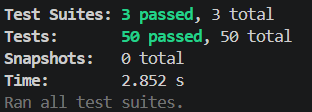

Si possono sfruttare anche gli export della collection e dell'enviroment di Postman per caricarli ed eseguire dei test delle rotte. Questi file si trovano nella cartella `./postman`

---

***MARCUCCI GIACOMO***